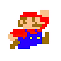
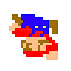
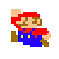

# Bitmap Transformer
## About
An application written in Java that allows the user to use their command line to run various transforms on a a bitmap. A new file is then saved to the desired location in the user's local repository.

Currently works reliably with .bmp files.


## Contributors
Functional code that reads and writes files and transforms image to grayscale written by:
* Sharina Stubbs
* Paula Cruz

Modularized code - following best practice for OOP - tests and additional transforms written by:
* Sharina Stubbs

## How to run the application
As application is currently written, it is designed to be run through the command line using gradlew. 
* the first argument will be the relative input filepath (ie, assets/mario.bmp) 
* the second argument will be the output for the relative filepath (ie, assets/newMario.bmp)
* the third argument will be `no` if no transformation is desired, just a copy. If a transformation is desired, the third argument will be the name of a transformation available (ie, grayscale)

### gradlew command with an example
```
./gradlew run --args 'assets/mario.bmp assets/newMario.bmp grayscale'
```

## Current transformations available, to be used as the third argument in the command line:
### Turn a color image into grayscale
`grayscale`
### Make a copy of an image
Any word you like, such as:
`copy`


### Turn colors of the image into shades of green
`green`


### Fill image with solid shade of pink, obliterating original image
`pink-box`


### Make a negative of an image
`negative`


### Turn image upside down and reverse
`vertical`



### Make a mirror image - horizontal reversal
`mirror`



# Steps in Building A BitMap 
Steps kindly shared by software developer, Jeff Borda.
* Go to java-basics. Gradle init: $ gradle init --type java-application
* Initial project setup:
  * gitignore
  * README.md
* Create a Bitmap class
* Bitmap constructor: Bitmap(intputPath, outputPath)
* Write save() method, so initial setup can be verified
* Add some bitmap images to a /resources folder.
* Develop main method in app, so it takes in arguments from CLI. After this it can be run to check if it's working by taking in a file and saving it again.
* Now implement the CLI in the main method. Can use a switch. Will be able to take in input file path, output file path, and transform name.
* Create empty methods for those transforms so they can be called without errors. Test again that the image is being saved. Write 'flipVertically' method.
* Write 'flipHorizontally' method.
* Write 'addRedBorder' method. 
* Write tests. Can make test images. 

# Resources
* [resource referenced for reading and writing bitmap file](https://www.youtube.com/watch?v=lGX0Gc6d51s&feature=youtu.be)
* [reference used to learn how to convert to grayscale](https://www.youtube.com/watch?v=cq80Itgs5Lw&amp=&feature=youtu.be)


